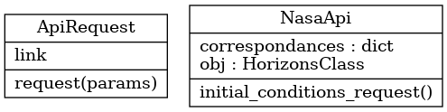
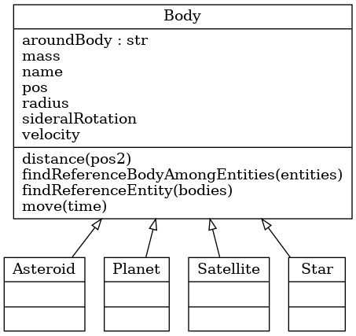
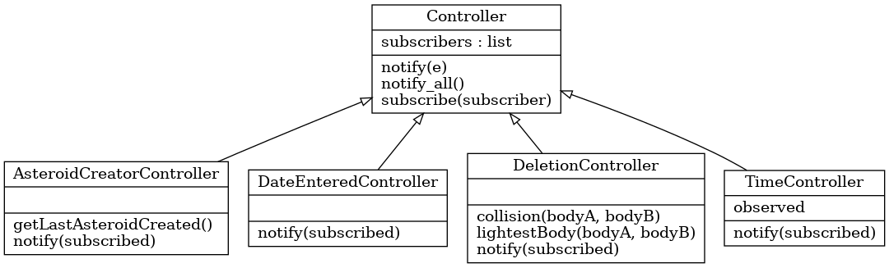
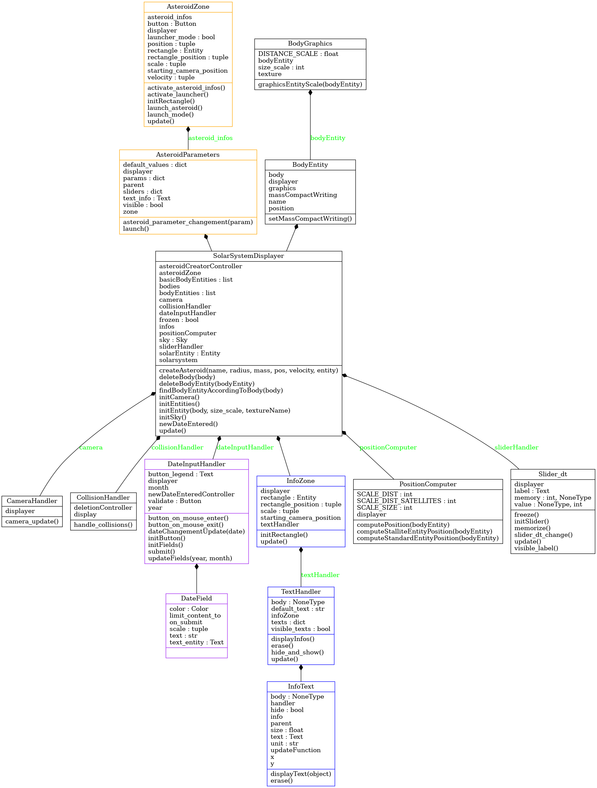
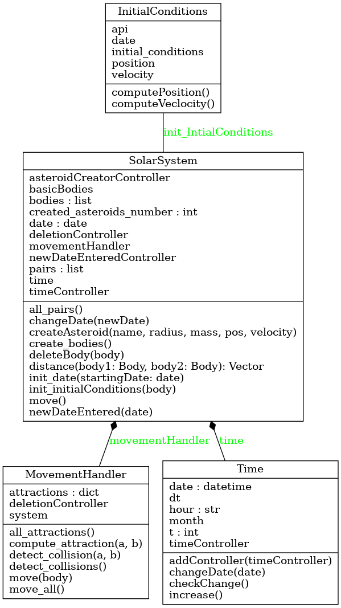

## Dubuisson Samuel

# Rapport de projet : Simulation d'un système solaire 

- [Rapport de projet : Simulation d'un système solaire](#rapport-de-projet--simulation-dun-système-solaire)
  - [Expression du besoin](#expression-du-besoin)
  - [Plan de tests](#plan-de-tests)
  - [Dossier de conception](#dossier-de-conception)
    - [Architecture du programme](#architecture-du-programme)
    - [Algorithmes](#algorithmes)
    - [Tests](#tests)
    - [Manuel de l'interface](#manuel-de-linterface)
    - [Expérimentations](#expérimentations)
  - [Compte-rendu des avancées, problèmes recontrés, points à améliorer](#compte-rendu-des-avancées-problèmes-recontrés-points-à-améliorer)
    - [Avancées](#avancées)
    - [Refactoring et documentations](#refactoring-et-documentations)
    - [Problèmes rencontrés](#problèmes-rencontrés)
    - [Points à améliorer](#points-à-améliorer)
  - [How to ?](#how-to-)

## Expression du besoin 

L'idée du projet est de pouvoir offrir à l'utilisateur un outil lui permettant d'avoir une représentation assez fidèle du système solaire. Il pourra également intéragir avec sur plusieurs points : entrée d'une nouvelle date, gérer le temps et la vitesse du système, créations et envois d'astéroides, obtenir des informations sur les bodies, 

## Plan de tests

> Dans les explications techniques, lorsque nous parlerons de `calculateur`, nous ferons référence aux classes des packages `SolarSystem`, `Util` et `Bodies`. Lorsque nous parlerons d'`afficheur`, nous ferons référence aux classes du package `Display`.

Différents types de tests mis en place : tests unitaires et fonctionnels. Les tests unitaires ont globalement été privilégiés, mais pour certains points du projet, des tests fonctionnels (vérifier une fonctionnalité plutôt que le bon fonctionnement d'une méthode précise) étaient préférables.

Les tests unitaires ont été utilisés pour tester le bon fonctionnement des classes ou éléments suivants :
- les corps célestes et leurs méthodes élémentaires 
- les lois physiques du mouvement et de l'attraction implémentés 
- le displayer
- le collision handler côté affichage
- la classe de vecteur utilisée pour manipuler les données, distances, et attractions
- le système solaire et ses méthodes élémentaires
- la gestion du temps
- le calcul des positions pour l'afficheur
- les controllers

En plus de cela, des tests fonctionnels permettent de vérifier le bon fonctionnement des collisions côté calcul (test_collisions.py)

## Dossier de conception

### Architecture du programme 

Le projet se compose des packages suivants : 
- Api 
- Bodies 
- Controllers 
- Display 
- SolarSystem 
- Util 

Expliquons en détail le rôle de chaque package.

- Api

J'utilise 2 APIs pour ce projet. La première est l'API Rest "https://api.le-systeme-solaire.net/rest/bodies". Cela me permet de récupérer les données clés qui caractérisent chaque planète : masse, rayon, les distances au périhélion et à l'aphélion, vitesse, etc. La seconde est l'API fournie par la NASA, qui me permet d'obtenir en plus de la distance, les coordonnées sous forme de vecteur dans un repère en 3 dimensions des bodies à une date donnée. Ainsi, quand à l'initialisation du projet, ou bien quand l'utilsiateur renseigne une nouvelle date, l'API va récupérer les positions et vitesses à la date voulue. 

- Bodies

Une classe Bodies définit les corps avec leurs méthodes élémentaires. Différents types de Bodies en héritent (Star, Planet, Asteroid). Ces classes permettent de facilement imaginer des méthodes spécifiques à chaque type de body, pour l'instant le besoin n'en a pas été trouvé. Ces classes permettent cependant de définir des paramètres par défaut spécifiques dans les constructeurs, et de rendre le code plus clair.

- Controllers

Les controllers sont des points de communication entre l'afficheur (`SolarSystemDisplayer`) et le calculateur (`SolarSystem`, `Bodies`, `Util`). Cette architecture de programme est appelé `PAC` (Présentation, abstraction, contrôle). Tout événement majeur qui nécessite une communication entre les deux, ou qui demande à l'un d'avertir l'autre passe par les controllers (nouveau corps créé ou détruit, changement de date, nouvelle date initiale renseignée par l'utilisateur, etc.). Ainsi on a une classe abstraite de base : le controller, qui utilise `l'observateur`. Sa méthode `notify_all` permet de notifier chacun des abonnées au controlelr. Chacun des controllers qui en hérite redéfinit sa propre fonction `notify`, et grâce au polymorphisme, c'est ce `notify` qui sera appelé. Chaque `notify` permet donc d'appeler une fonction spécifique de l'abonné. Chaque controller peut également spécifier des nouvelles méthodes, par exemple `AsteroidCreatorController` définit un `getLastAsteroidCreated` qui permet à l'afficheur de connaître l'astéroide tout nouvellement créé par le calculateur.

- Display

Les couleurs dans le diagramme représentent les sous-diagrammes : 
- Les classes en bleu appartiennent au sous-package : `InfoZone`, utilisée pour la partie en haut à droite de l'afficheur, qui affiche les données des bodies. Afin d'éviter de tout le temps actualiser les infos avec les infos que la souris survole, un pattern observeur a été utilisé pour appeler la méthode `update` uniquement quand la souris passe survole un nouveau body.
- Les classes en orange appartiennent au sous-package : `AsteroidZone`, utilisée pour afficher tout ce qui est nécessaire à l'Asteroid launcher
- Les classes en violet appartiennent au sous-package : `DateInput`, utilisée pour afficher tout ce qui est relatif aux dates (permet de l'afficher, et à l'utilisateur de rentrer la date qu'il souhaite)
  
La classe `SolarSystemDisplayer` est la classe centrale côté affichage. Elle se charge d'organiser et d'afficher les composants graphiques. Elle sert donc également de `Médiateur` entre tous les composants graphiques annexes (qu'on retrouve par exemple dans les sous packages expliquées précédemment, on trouve aussi par exemple le `Slider_dt`, qui permet de décider de l'intervalle de temps entre chaque rendu de l'affichage).
Le moteur graphique utilisée est `Ursina`, les objets graphiques sont des `Entity` et peuvent être mis à jour à chaque frame en appelant leur méthode `update`. Une classe `BodyEntity` qui hérite de cette classe `Entity` a été redéfinie pour afficher les bodies. `BodyEntity` est composé d'un `BodyGraphics`, qui définit les caractéristiques graphiques de chaque body, comme la taille (si on gardait des tailles exactement proportionnelles à la réalité, certains bodies seraient presques invisibles, et les distances paraitraient énormes)
Des classes annexes sont utilisées pour les algorithmes côté affichage : `CollisionHandler` (gère les collisions côté affichage, pour le confort de l'utilisateur, si deux bodies entrent en collisions côté affichage, une collision est repérée, bien que côté calculateur une collision ne s'est peut-être pas produit), `PositionHandler` (utilisée pour transformer les positions et distances côté calculateur vers le côté afficheur). Cette classe `PositionHandler` est particulièrement importante pour les satellites. Dans un objectif de clareté de rendu, les satellites sont affichées par rapport au body autour duquel il tourne et non par rapport au soleil. Si c'était le cas, on les verrait se superposait avec leur body de référence (on pourrait voir la lune et la terre se superposer par exemple).

J'ai essayé de séparer au maximum les rôles dans le displayer pour clarifier les choses. On se retrouve donc rapidement avec beaucoup de classes. J'ai essayé d'organiser les classes de la meilleure manière possible, via des compositions et aggrgations, pour arriver à se retrouver le plus facilement possible entre les différentes classes. 

- SolarSystem 

Ce package représente le côté Calculateur du projet. La classe `SolarSystem` se charge de rassembler les différents bodies. Le `MovementHandler` se charge d'utiliser les lois physiques pour mettre en mouvement les différentes bodies, et donc à chaque fin de tour de vérifier les collisions. Quant à `InitialConditions`, il se charge de calculer les condiotions initiales (position, vitesse, trajectoire) de chaque body, quand une nouvelle date est renseignée (nouvelle date entrée par l'utilisateur dans notre cas). Quand il est appelé, il se charge donc d'appeler les API et de réaliser les calculs nécessaires à l'initialisation des bodies.
La classe `Time` prend en charge tout ce qui s'apparente au temps, c'est elle qui avertit par exemple l'affichage, via les controllers, quand un nouveau mois arrive, pour mettre à jour l'afficheur de date (il ne prend en compte que les mois et années).

- Util

Le package Util définit tous les éléments annexes au bon fonctionnement du projet : les lois physiques (définies dans le fichier `Laws`), des constantes, et la classe `Vector` utilisée pour représenter les positions et vitesses dans un espace à 3 dimensions. 

### Algorithmes

L'algorithme central du projet et le calcul et la gestion des trajectoires de chaque corps. Des algortihmes annexes sont également présents, comme la détection et gestion des collisions.

Prenons l'algortihme principal, et un algorithme annexe, et expliquons les en détail :

- Calcul et gestion des trajectoires

À la création du système, le calculateur stocke une table `SolarSystem.all_pairs` qui contient toutes les paires de bodies possibles. Au début nous en avons donc $n * (n-1) / 2$ paires, n valant $10$, cela nous fait $45$ paires. À chaque nouvel ajout ou suppression de corps, on met à jour le dictionnaire de paires. Le calculateur initie également dictionnaire `MovementHandler.attractions` avec les forces d'attraction correspondantes à chacune de ces paires. Dans ce dictionnaire, chaque body aurait pour valeur un nouveau dictionnaire qui prendra comme clé un body autre, et sa force d'attraction sur le body concerné. Ainsi on peut facilement savoir la force appliquée par le body b sur le body a en allant chercher attractions[a][b]. Pour obtenir la force d'attraction totale appliquée à un body a, il suffit de sommer toutes les forces d'attractions des valeurs contenues dans le dictionnaire de attractions[a].  
Ainsi, à chaque nouveau tour de rendu de notre système, le calculateur met à jour ces forces, en utilisant la loi de Gravitation de Newton, $F = (G * m1 * m2) / r^2$ définie dans le fichier Laws. Grâce à la la loi d'action-réaction (troisième loi de Newton), il nous suffit de calculer une seule fois la force d'attraction pour une paire (a,b) et d'appliquer la force contraire pour la même force dans l'autre sens. Ces calculs prennent donc en compte la table de distances ainsi que les caractéristiques de chaque corps (ici la masse). Une fois la table des attractions calculées, on applique la deuxième loi de Newton, $F = ma$ ou $a = F/m$, pour calculer le vecteur accélération en fonction de la force et de la masse de chaque corps. Chaque corps met ensuite à jour son vecteur de mouvement en utilisant le vecteur accélération nouvellement définie, en se basant sur l'intervalle de temps définie (si la vitesse sur l'axe X est de $0.5m/s$, et sur l'axe Y est de $1m/s$, et l'intervalle de 1h, on le déplace de $1800m$ sur l'axe X et de $3600m$ sur l'axe Y). 

- Détection et gestion des collisions 

À chaque tour de rendu, on vérifie que des corps n'entrent pas en collision. Pour vérifier cela, on vérifie pour chaque paire de corps, si la distance entre ces deux corps, à laquelle on soustrait la somme de leurs rayons, n'est pas inférieur à une certaine valeur. Dans l'idéal il faudrait que cette valeur soit de zéro (une collision n'est détecté que si les deux corps se superposent). Or cela ne fonctionnerait bien que si notre système est continu. Or, pour des raisons évidentes d'affichage et de performance, il ne le calcule qu'après un certain nombre d'heure défini par l'utilisateur. Ainsi on fixe cette valeur à la moitié de la distance terre-lune, on considère donc dans notre modèle, que si à un tour de rendu, deux corps sont à une distance inférieure à celle-ci, ils entrent en collision (ils risquent de toute manière d'entrer en collision).  
Dans un souci de bonne expérience utilisateur, j'ai également fait en sorte que si deux entités graphiques de corps se superposent à l'affichage, ils entrent en collision également (même idée de calcul, la distance entre les deux corps est ici la distance du côté de l'afficheur, et la rayon, la moitié de la taille de l'entité graphique).  
Quand une collision est détectée par l'afficheur ou le calculateur, un message est envoyée par celui qui l'a détecté au controller correspondant, qui se charge de déterminer le body avec la masse la plus faible. Une fois cela fait, il le communique à l'afficheur et au calculateur, qui se chargent de le supprimer. Le body avec la masse la plus importante reste.  

### Tests

Pour veiller au bon fonctionnement des tests des `Bodies`, et pour avoir une bonne maintenabilité dans l'avenir, une `factory method` a été utilisée pour effectuer les tests de chaque type de corps. Cela est particulièrement utile pour tester chacune des fonctions sur chaque corps, et le sera encore plus si plus tard des fonctionnalités très spécifiques sont ajoutées sur une des classes. On pourra vérifier efficacement si cela n'interfère pas avec les fonctions classiques.
Des mocks ont également été créés quand nécessaires pour tester des fonctionnalités précises, pour vérifier un appel à une fonction par exemple (le `notify` des `Controllers`, ou encore le `CheckChange` de `Time`).
L'ensemble des tests est organisé de la même manière que le code source. 

### Manuel de l'interface

Il a fallu tout d'abord se demander comment représenter le système. On ne peut pas le retranscrire en une échelle proportionnellement identique à la réalité. Les bodies seraient beaucoup trop petits par rapport aux distances qui les séparent. Le soleil serait peut-être visible, mais peu de planètes le seront. Il faut cependant produire un rendu fidèle à la réalité. J'ai donc décidé de respecter les distances réelles (il faut donc bien dézoomer pour voir les planètes gazeuses), mais les bodies ont une taille plus importante. Ainsi ils sont bien visibles, et les distances sont respectées.  

Différentes commandes et intéractions sont disponibles pour l'utilisateur, voici un tour des possibilités :

- Gestion de la caméra :
  + `g` pour zoomer
  + `h` pour dézoomer
  + `Alt` + `<number>` pour tout chiffre entre 1 et 9. Cela permet de centrer la caméra sur le corps `<number>` : 0 correspond au Soleil, 9 à la Lune, et les chiffres 1 à 8 correspondent aux planètes du système solaire rangés dans l'ordre (de Mercure à Neptune). Cela est donc uniquement possible pour les corps qui existent dès la création du système.
  
- Informations sur un corps céleste :
  + Survoler sa souris sur un corps céleste affichera des informations clés sur celui-ci en haut à droite de l'écran (entrer la commande `Alt` + `<number>` sur le corps céleste correspondant aura le même effet s'il un chiffre lui est attribué).
  + Le bouton `Hide`/`Show` permet d'afficher ou non les informations en haut à droite pour le body actuel et les futurs
  + `e` (pour erase) supprime les infos du body actuel

- Dates
    + Deux zones d'input montrent la date courante (année / mois).
    +  L'utilisateur peut la changer en entrant une nouvelle date, et en pressant le boutton "Change Date". Si le format de la date est incorrecte, rien ne se passe. L'utilisateur peut entrer une date entre janvier 1800 et décembre 2150 (échelle prise en compte par l'API de la NASA, pour obtenir la position d'une planète à une date donnée). 
    +  Si une date qui n'est pas dans cette intervalle est saisie, elle est ramenée à la borne la plus proche. Tous les nouveaux corps nouvellement créés sont donc supprimés (les astéroïdes), et seuls les corps initiaux sont conservés (soleil, planètes et lune)

- Intervalle de temps
  + Le slider représente le nombre d'heures qui se déroule entre chaque tour de rendu du système.
  + L'utilsiateur peut faire glisser le slider pour actualiser en temps réel cet intervalle de temps. Il peut donc voir directement le système ralentir ou s'accélérer.
  + `f` (freeze) permet de geler temporairement le système et de placer le slider d'intervalle de temps à 0. Inversement, `r` (refresh) permet de replacer le slider à la valeur qu'il avait avant le freeze.   

- Lancements d'astéroïdes
    + En appuyant sur le bouton `Launch an asteroid` en bas à gauche de l'écran, des sliders s'affichent, où l'utilisateur peut renseigner les informations qu'il souhaite pour ses prochains astéroides : sa masse et son rayon. 
    + Il peut ensuite lancer les astéroïdes comme il le souhaite, en sélectionnant un point de l'univers, avec `Alt` et sa souris, et fait glisser sa souris dans la direction où il veut propulser son astéroïde. Plus la distance maintenaue avec la souris est longue, plus l'astéroïde aura une vitesse intiale élevée.
  
  

### Expérimentations 

En plus des tests unitaires et fonctionnels, quelques autres expérimentations ont été réalisés pour vérifier le bon fonctionnement du système (elles ont parfois été reprises et formalisées dans des tests indépendants):
- Alignement de Vénus et Jupiter visible depuis la Terre en mars 2023. En sélectionnant cette date, on observe que l'alignement est bien présent.
- Des astéroïdes assez massifs peuvent effectivement dévier certaines planètes de leur trajectoire (expérimenté sur Mars par exemple), et les fait s'expulser du système solaire, ou bien les fait revenir dans une orbite incongrue.
- Le corps céleste le plus léger est bien détruit après une collision entre deux corps (expérimenté entre autres entre deux astéroïdes de masses différentes)
- Le bon fonctionnement des éléments d'intéraction pour l'affichage (zoom sur planètes, informations au survolement, sliders, input de dates, etc.)

## Compte-rendu des avancées, problèmes recontrés, points à améliorer

### Avancées

Commencement : 05 janvier 2023

- **Semaine 1 et 2**  

Travail sur arbre B  

- **Semaine 3** 

Changement de sujet : système solaire  

Initialisation du projet  
Trajectoire des corps (`Bodies`)  
Obtention des infos essentielles des planètes via une API  

- **Semaine 4** 

Initialisation des tests sur les lois et les corps  
Visualisation du projet sur matplotlib
Initialisation de la classe `initialConditions` (obtenir les infos d'un body en fonction d'une date)  

- **Semaine 5**  

Utilisation de l'API fournie par la NASA pour obtenir les informations d'une planètes en fonction de la date  
Gestion de la vitesse intiale des bodies, en fonction d'une date  

- **Semaine 6**  

Travail sur un nouvel afficheur, en utilisant python Ursina  
Création des classes essentielles à l'afficheur  

- **Semaine 7**  

Réflexions sur les échelles du `displayer`  
Utilisation de sliders pour représenter l'intervalle de temps et la date.   
Initialisations des communications avec le calculateur
Ajout de la lune  

- **Semaine 8**  

Nouvelle échelle d'affichage des distances sur l'afficheur, cela ne dépend plus seulement du body, mais de sa position (cela permet d'avoir d'observer de potentiels changements de trajectoire)  
Nouveaux tests  

- **Semaine 9**  

Création des Controllers pour faciliter la communication entre calculateur et afficheur  
Basculement du slider vers un `textInput` pour l'affichage des dates  
Initialisation de la partie `asteroidLauncher`, avec la création d'un panel pour entrer les informations de l'astéroïde  

- **Semaine 10**  

Suite du travail sur la création d'astéroïdes  
Création d'un détecteur de collisions  
Intialisation de threads pour accélérer le calcul des conditions initiales (semble poser des problèmes avec l'API)

- **Semaine 11** 

Changement de l'interface pour la création d'astéroïdes (passage d'un panel, à un système de cliques et de glissement de souris)  
Création sur le détecteur de collisions  
Travail sur l'interface  

- **Semaine 12**

Finalisation des tests  
Création de nouveaux controllers  
Finalisation du textInput pour les dates  
Améliorations et réparations de fonctionnalités diverses

### Refactoring et documentations  

La plupart des semaines, j'ai essayé de refactorer le code, de le nettoyer et documenter des parties importantes, afin de pouvoir tenir une bonne gestion du projet sur le long terme.

### Problèmes rencontrés 

- Cela a pris un peu de temps pour obtenir des trajectoires correctes bien affichées (on a facilement des erreurs de formules, d'unités, de signes ou autre)  
- Découvrir et rapidement prendre en main un moteur graphique  
- Gestion d'un gros projet sur python (gestion des imports, packages, etc.)

### Bugs et points à améliorer

- Ajouter des effets pour les collisions
- Se pencher sur le problème des threads avec l'API fournie par la NASA. Les threads permettraient d'accélérer le calcul des conditions intiales en parallélisant. En utilisant les threads, cela provoque parfois un bug : la lune n'a plus de vitesse. Je n'ai pas encore trouvé pourquoi cela se produit. Peut-être que l'API est construite pour refuser plusieurs requêtes simultanées d'un même utilisateur.
- Avec des intervalles de temps importantes, les collisions ne fonctionnement pas toujours comme souhaité. On a parfois à la place des très grandes accélérations. Je pense que cela est dû au fait qu'on travaille avec des intervalles, et pas en temps continu. Les bodies passent donc des fois "à travers". De plus, l'espace est en 3d, alors que l'affichage est en 2d, ce qui peut peut-être créer des illusions. On peut donc imaginer un affichage en 3d dans le futur, qui sera cependant plus demandant en ressources.
- Les astéroïdes ne sont pas créés exactement à l'endroit où pointe la souris. La position semble correcte au centre du système, mais pas quand on s'éloigne du centre.

## How to ?

> Les commandes suivantes doivent être exécutées à la racine du projet.

Pour lancer les tests, il faut entrer la commande :  
`make run_tests`

Pour installer les dépendances, il faut entrer la commande :  
`pip install -r requirements.txt`

Pour lancer le projet une fois les dépendances installées, il faut entrer la commande :  
`make` ou `make main`
